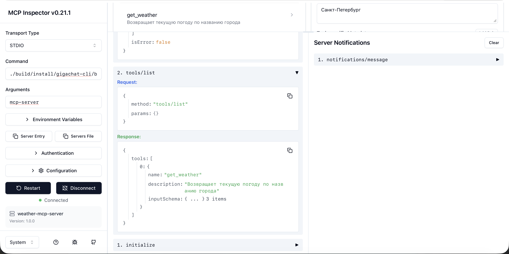
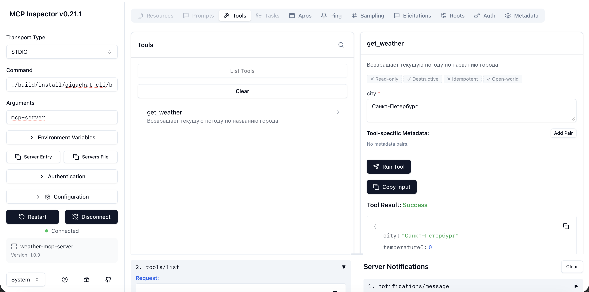
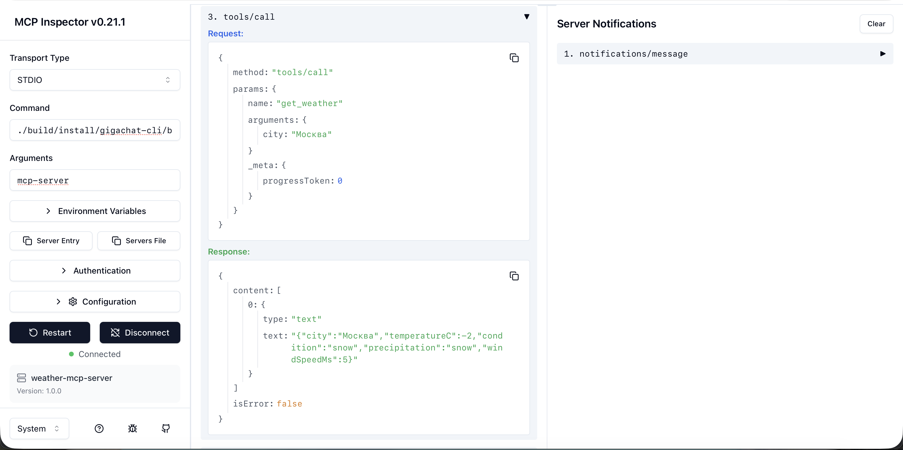

# GigaChat CLI на Kotlin

Простой CLI-чат на Kotlin с подключением к **GigaChat API**.

Проект реализует консольный интерфейс для общения с моделью, хранит историю сообщений в памяти и позволяет во время работы менять **модель**, **temperature** и **system prompt**.  
Дополнительно реализованы отдельные demo-режимы для:

- **structured output** с разбором JSON в Kotlin data class
- **function calling** с нативным вызовом локальной функции через формат **GigaChat API**
- **MCP server** по протоколу **Model Context Protocol** через **stdio**

---

## Что реализовано

Проект поддерживает:

- подключение к **GigaChat API**
- ввод текста с консоли
- отправку запроса в API
- вывод ответа в консоль
- хранение истории диалога в памяти
- смену модели: **Lite / Pro / Max**
- смену **temperature**
- смену **system prompt**
- demo-сценарий для **structured output**
- demo-сценарий для **function calling**
- demo-сценарий для **MCP server** с tool `get_weather`

---

## Стек

Проект собран на **Kotlin/JVM** и использует:

- **Kotlin 1.9.24**
- **JDK 17**
- **Gradle 8.10.2**
- **OkHttp** для HTTP-запросов
- **Jackson** для JSON
- **MCP Inspector** для проверки MCP server

---

## Структура проекта

Базовая структура проекта:

```text
gigachat-cli/
├── build.gradle.kts
├── settings.gradle.kts
├── README.md
├── homework-2-task1.md
├── lessons_1.md
├── lessons_3.md
├── screenshots/
│   ├── tools_call.png
│   ├── tools_list_1.png
│   └── tools_list_2.png
└── src/
    └── main/
        └── kotlin/
            ├── Main.kt
            ├── CliChat.kt
            ├── GigaChatClient.kt
            ├── Models.kt
            ├── StructuredOutputDemo.kt
            ├── FunctionCallingDemo.kt
            ├── WeatherService.kt
            ├── McpModels.kt
            └── McpServer.kt
```

> Допустимо, если часть demo-кода находится не в отдельных файлах, а в уже существующих Kotlin-файлах. Главное, чтобы режимы запуска работали корректно.

---

## Требования для запуска

Перед запуском должны быть установлены:

- **JDK 17**
- доступ в интернет
- ключ авторизации для GigaChat API
- **Node.js / npm** — для запуска **MCP Inspector**

Проверка Java:

```bash
java --version
./gradlew -version
```

Ожидается, что и `java`, и `Gradle JVM` используют **Java 17**.

Проверка Node.js и npm:

```bash
node -v
npm -v
npx -v
```

---

## Переменные окружения

Для запуска GigaChat-режимов используется переменная:

- `GIGACHAT_AUTH_KEY` — Base64 от строки `clientId:clientSecret`

Пример:

```bash
export GIGACHAT_AUTH_KEY='ВАШ_BASE64_КЛЮЧ'
```

### Дополнительно

В проекте поддержан флаг:

- `GIGACHAT_UNSAFE_SSL=true`

Он включает небезопасный SSL-режим для локальной отладки, если JVM не доверяет TLS-цепочке OAuth endpoint.

Пример:

```bash
export GIGACHAT_UNSAFE_SSL=true
```

> Этот режим нужен только для локальной диагностики и разработки.

### Важное замечание для MCP server

Режим `mcp-server` не использует GigaChat API напрямую, поэтому для его локальной проверки переменная `GIGACHAT_AUTH_KEY` не требуется.

---

## Сборка проекта

Сборка через Gradle:

```bash
./gradlew clean installDist
```

После успешной сборки исполняемый скрипт будет находиться здесь:

```bash
./build/install/gigachat-cli/bin/gigachat-cli
```

---

## Режимы запуска

Проект поддерживает четыре основных режима:

- `chat` — интерактивный CLI-чат
- `structured-output` — demo structured output
- `function-calling` — demo function calling
- `mcp-server` — MCP-сервер по stdio с tool `get_weather`

---

## Запуск интерактивного CLI

Для интерактивного чата рекомендуется использовать **launch script**, собранный через `installDist`:

```bash
export GIGACHAT_AUTH_KEY='ВАШ_BASE64_КЛЮЧ'
export GIGACHAT_UNSAFE_SSL=true
./gradlew clean installDist
./build/install/gigachat-cli/bin/gigachat-cli
```

Если `unsafe SSL` не нужен:

```bash
export GIGACHAT_AUTH_KEY='ВАШ_BASE64_КЛЮЧ'
./gradlew clean installDist
./build/install/gigachat-cli/bin/gigachat-cli
```

Этот режим был проверен и работает корректно.

### Пример вывода при старте

```text
Starting GigaChat app...
Unsafe SSL mode: true
GigaChat CLI Chat
Model: GigaChat, Temp: 0.87, System: "Ты полезный AI-ассистент."
Commands:
/model Lite|Pro|Max
/temp <0..2>
/system <text>
/history
/help
/quit
You:
```

---

## Альтернативный запуск через Gradle

Можно использовать запуск через Gradle:

```bash
./gradlew run --args="chat"
```

или:

```bash
./gradlew run --args="structured-output"
```

или:

```bash
./gradlew run --args="function-calling"
```

или:

```bash
./gradlew run --args="mcp-server"
```

Но есть важное отличие:

- `./gradlew run --args="chat"` в текущем окружении **не поддерживает интерактивный ввод** и завершает программу после старта
- `./gradlew run --args="structured-output"` работает корректно
- `./gradlew run --args="function-calling"` работает корректно
- `./gradlew run --args="mcp-server"` в текущем окружении тоже может сразу завершаться, если Gradle не удерживает `stdin` для stdio-сервера

Поэтому для обычного CLI-чата и для MCP server рекомендуется использовать именно:

```bash
./build/install/gigachat-cli/bin/gigachat-cli
```

---

## Structured Output Demo

Для демонстрации structured output реализован отдельный режим запуска:

```bash
./gradlew run --args="structured-output"
```

В этом режиме приложение:

1. отправляет **несколько тестовых пользовательских отзывов** в GigaChat
2. просит модель вернуть ответ в виде **строгого JSON**
3. при необходимости использует **defensive fallback** для извлечения JSON из raw response
4. парсит ответ в Kotlin data class
5. валидирует результат
6. печатает результат в структурированном виде

### Что именно демонстрирует этот режим

Structured output в проекте реализован как полный цикл:

- **system prompt** задаёт жёсткую JSON-схему ответа
- модель возвращает JSON-объект
- приложение извлекает JSON из ответа модели
- JSON десериализуется в Kotlin-структуру
- результат проходит базовую валидацию и выводится в читаемом виде

Это демонстрирует подход **prompt → JSON → объект → читаемый вывод**.

### Схема результата

Для structured output используются enum-поля и Kotlin data class:

- `sentiment`: `positive | neutral | negative`
- `category`: `ui | stability | performance | billing | notifications | other`
- `priority`: `low | medium | high`
- `summary`: краткое резюме отзыва

### Пример ответа модели

```json
{
  "sentiment": "negative",
  "category": "stability",
  "priority": "high",
  "summary": "Зависание и вылеты после обновления"
}
```

### Пример вывода приложения

Ниже — пример реального вывода режима `structured-output`:

```text
Starting GigaChat app...
Unsafe SSL mode: true
Running structured output demo...
Model: GigaChat
Example 1:
Review:
После последнего обновления приложение зависает на экране логина и иногда вылетает.

Raw model response:
{
  "sentiment": "negative",
  "category": "stability",
  "priority": "high",
  "summary": "Зависание и вылеты приложения после обновления"
}

Parsed result:
  Sentiment : negative
  Category  : stability
  Priority  : high
  Summary   : Зависание и вылеты приложения после обновления

--------------------------------------------------

Example 2:
Review:
Уведомления иногда приходят с задержкой, но в целом приложение работает нормально.

Raw model response:
{
  "sentiment": "neutral",
  "category": "notifications",
  "priority": "medium",
  "summary": "Задержка уведомлений"
}

Parsed result:
  Sentiment : neutral
  Category  : notifications
  Priority  : medium
  Summary   : Задержка уведомлений

--------------------------------------------------

Example 3:
Review:
Очень понравился новый интерфейс, всё стало заметно удобнее.

Raw model response:
{
  "sentiment": "positive",
  "category": "ui",
  "priority": "low",
  "summary": "Положительный отзыв о новом удобном интерфейсе"
}

Parsed result:
  Sentiment : positive
  Category  : ui
  Priority  : low
  Summary   : Положительный отзыв о новом удобном интерфейсе

--------------------------------------------------
```

### Важное замечание

Даже при строгом system prompt модель иногда может вернуть JSON с markdown-обёрткой или с лишним текстом.  
Поэтому в проекте используется функция defensive extraction: приложение сначала **просит строгий JSON**, а затем при необходимости **извлекает JSON из raw response**.

Это не заменяет prompt, а делает интеграцию более устойчивой.

---

## Function Calling Demo

Для демонстрации function calling реализован отдельный режим запуска:

```bash
./gradlew run --args="function-calling"
```

В этом режиме приложение показывает **нативный полный цикл function calling через GigaChat API**:

1. пользователь задаёт вопрос
2. приложение отправляет запрос с описанием функции в поле `functions`
3. запрос отправляется с `function_call: "auto"`
4. модель сама решает, нужен ли вызов функции
5. если модель возвращает `finish_reason = "function_call"`, приложение извлекает `message.function_call`
6. приложение выполняет локальную Kotlin-функцию
7. результат функции сериализуется в JSON-строку и отправляется обратно модели как сообщение роли `function`
8. модель формирует финальный ответ пользователю

### Что именно демонстрирует этот режим

Function calling в проекте реализован через формат GigaChat API, а не через имитацию JSON в prompt.

В demo используется локальная функция:

```text
getWeather(city: String)
```

Она возвращает мок-данные о погоде в структурированном виде, например:

```json
{
  "city": "Москва",
  "temperatureC": -2,
  "condition": "snow",
  "precipitation": "snow",
  "windSpeedMs": 5
}
```

### Пример описания функции

В запрос передаётся описание функции в формате GigaChat API:

```json
[
  {
    "name": "getWeather",
    "description": "Возвращает текущую погоду по названию города",
    "parameters": {
      "type": "object",
      "properties": {
        "city": {
          "type": "string",
          "description": "Название города"
        }
      },
      "required": ["city"]
    }
  }
]
```

### Пример ответа модели на первом шаге

Если модель решает вызвать функцию, она возвращает `finish_reason = "function_call"` и структуру вызова функции:

```json
{
  "choices": [
    {
      "message": {
        "role": "assistant",
        "content": "",
        "function_call": {
          "name": "getWeather",
          "arguments": {
            "city": "Москва"
          }
        }
      },
      "finish_reason": "function_call"
    }
  ]
}
```

### Пример вывода приложения

Ниже — пример реального вывода режима `function-calling`:

```text
Starting GigaChat app...
Unsafe SSL mode: true
Running function calling demo...
Model: GigaChat
User: Какая погода в Москве?

Raw first response:
{
  "choices" : [ {
    "message" : {
      "role" : "assistant",
      "content" : "",
      "function_call" : {
        "name" : "getWeather",
        "arguments" : {
          "city" : "Москва"
        }
      }
    },
    "finish_reason" : "function_call"
  } ]
}

Model requested function call: getWeather(city=Москва)

Function result:
{"city":"Москва","temperatureC":-2,"condition":"snow","precipitation":"snow","windSpeedMs":5}

Final answer:
Сейчас в Москве температура −2°C, идёт снег, ветрено (скорость ветра около 11 м/с).
```

### Важное замечание

В этой реализации function calling используется **реальный API-механизм**:

- функция описывается в `functions`
- запрос отправляется с `function_call: "auto"`
- приложение проверяет `finish_reason == "function_call"`
- аргументы функции берутся из `message.function_call.arguments`
- результат функции возвращается модели как JSON-строка
- финальный ответ генерирует модель

Это соответствует требованию задания: **вопрос → решение модели → вызов функции → возврат результата → финальный ответ**.

---

## MCP Server Demo

Для homework 3 в проект добавлен отдельный режим запуска MCP-сервера:

```bash
./gradlew clean installDist
./build/install/gigachat-cli/bin/gigachat-cli mcp-server
```

В этом режиме приложение запускается как **stdio MCP server** и ожидает JSON-RPC сообщения от MCP-клиента.

Сервер реализует минимальный набор MCP-методов:

- `initialize`
- `notifications/initialized`
- `tools/list`
- `tools/call`

### Tool, который предоставляет сервер

Сервер публикует один tool:

- `get_weather`

### Что делает tool

Tool `get_weather` принимает аргумент:

```json
{
  "city": "Москва"
}
```

и возвращает мок-данные о погоде, например:

```json
{
  "city": "Москва",
  "temperatureC": -2,
  "condition": "snow",
  "precipitation": "snow",
  "windSpeedMs": 5
}
```

### Что именно демонстрирует этот режим

Этот режим показывает базовую интеграцию с **Model Context Protocol**:

- сервер работает по **stdio**
- принимает JSON-RPC сообщения из `stdin`
- отправляет JSON-RPC ответы в `stdout`
- публикует список доступных tools
- вызывает локальную Kotlin-логику по запросу клиента

То есть используется уже не формат function calling GigaChat API, а отдельный протокол взаимодействия между **MCP client** и **MCP server**.

### Важное замечание по stdio

В режиме `mcp-server` в `stdout` должны попадать только JSON-RPC ответы.  
Поэтому служебные логи сервера выводятся в `stderr`.

Это важно для корректной работы MCP Inspector и других stdio-клиентов.

### Почему для запуска лучше использовать installDist script

В текущем окружении режим `mcp-server`, как и интерактивный `chat`, не следует запускать через:

```bash
./gradlew run --args="mcp-server"
```

потому что Gradle в этом окружении может не удерживать интерактивный `stdin` так, как требуется stdio-серверу.  
Из-за этого сервер получает `EOF` и завершается сразу после старта.

Поэтому для локальной проверки рекомендуется использовать launch script после `installDist`:

```bash
./build/install/gigachat-cli/bin/gigachat-cli mcp-server
```

---

## Проверка MCP server через Inspector

Для проверки использовался **MCP Inspector**.

### Установка и запуск Inspector

Если `npx` ещё не установлен, нужно установить **Node.js / npm**.

Проверка:

```bash
node -v
npm -v
npx -v
```

Запуск Inspector:

```bash
npx @modelcontextprotocol/inspector
```

После запуска Inspector открывается в браузере локально.

### Подключение сервера в Inspector

В Inspector нужно указать:

| **Поле** | **Значение** |
|---|---|
| **Transport Type** | `STDIO` |
| **Command** | `./build/install/gigachat-cli/bin/gigachat-cli` |
| **Arguments** | `mcp-server` |

Краткий смысл этой таблицы: Inspector сам запускает локальный процесс сервера и подключается к нему по stdio.

### Что было проверено

Через Inspector были успешно проверены:

- подключение к серверу
- `tools/list`
- `tools/call`

### Скриншоты проверки

Ниже приведены скриншоты из папки `screenshots/`, подтверждающие успешную работу MCP server в Inspector.

#### 1. Список доступных tools

На этом скриншоте видно, что Inspector успешно подключился к серверу и получил результат `tools/list`, где опубликован tool `get_weather`.



#### 2. Вкладка Tools и ручной запуск tool

На этом скриншоте видно, что tool `get_weather` отображается во вкладке **Tools**, принимает параметр `city`, и успешно вызывается из UI Inspector.



#### 3. Прямой вызов `tools/call`

На этом скриншоте показан JSON-запрос `tools/call` с аргументом `"city": "Москва"` и корректный JSON-ответ сервера.



### Ожидаемый результат `tools/list`

Inspector должен показать tool:

```text
get_weather
```

### Пример вызова `tools/call`

Аргументы:

```json
{
  "city": "Москва"
}
```

Ожидаемый результат:

```json
{
  "city": "Москва",
  "temperatureC": -2,
  "condition": "snow",
  "precipitation": "snow",
  "windSpeedMs": 5
}
```

---

## Использование CLI

После запуска приложение выводит текущее состояние и список команд.

### Обычное сообщение

Любой текст без префикса `/` отправляется в GigaChat:

```text
You: what is the weather in moscow today?
GigaChat: У меня нет доступа к реальному времени или интернету, чтобы предоставить актуальную информацию о погоде.
```

---

## Команды

Ниже — команды, которые поддерживает CLI:

| **Команда** | **Описание** |
|---|---|
| `/model Lite` | переключить модель на Lite |
| `/model Pro` | переключить модель на Pro |
| `/model Max` | переключить модель на Max |
| `/temp 1.2` | установить temperature |
| `/system You are a strict teacher` | изменить system prompt |
| `/history` | показать историю диалога |
| `/help` | показать список команд |
| `/quit` | выйти из программы |

Ниже — краткий итог по этой таблице: CLI поддерживает смену модели, температуры, system prompt и просмотр истории прямо во время работы.

### Пример сессии

```text
You: Hello
GigaChat: Hello! How can I assist you today?

You: /model Max
Model switched to GigaChat-Max
Model: GigaChat-Max, Temp: 0.87, System: "Ты полезный AI-ассистент."

You: /temp 1
Temperature set to 1.0
Model: GigaChat-Max, Temp: 1.0, System: "Ты полезный AI-ассистент."

You: /system be a serious teacher
System prompt updated
Model: GigaChat-Max, Temp: 1.0, System: "be a serious teacher"

You: /history
History:
1. user: Hello
2. assistant: Hello! How can I assist you today?
```

---

## Как хранится история

История диалога хранится **в памяти** в виде массива сообщений:

- сообщения пользователя добавляются в `history`
- ответы модели тоже добавляются в `history`
- при каждом новом запросе отправляется:
    - текущий `system prompt`
    - вся накопленная история

Это соответствует требованию задания: **история в памяти (просто массив)**.

---

## Как работает выбор модели

В CLI используются алиасы:

- `Lite`
- `Pro`
- `Max`

Внутри они сопоставляются с реальными именами моделей, которые возвращает GigaChat API, например:

- `Lite` → `GigaChat` или `GigaChat-2`
- `Pro` → `GigaChat-Pro` или `GigaChat-2-Pro`
- `Max` → `GigaChat-Max` или `GigaChat-2-Max`

Это сделано потому, что API может возвращать реальные `model id`, отличающиеся от коротких пользовательских названий.

---

## Кодировка консоли

Для корректной работы вывода приложение запускается с UTF-8 JVM-параметрами:

```kotlin
applicationDefaultJvmArgs = listOf(
    "-Dfile.encoding=UTF-8",
    "-Dsun.stdout.encoding=UTF-8",
    "-Dsun.stderr.encoding=UTF-8"
)
```

Ввод из консоли читается через `BufferedReader` + `InputStreamReader(System.in, Charsets.UTF_8)`.

Это уменьшает риск проблем с кодировкой в интерактивном режиме и в stdio-сценариях.

---

## Возможные проблемы

Ниже — несколько типичных проблем и способов решения.

### 1. Не задан `GIGACHAT_AUTH_KEY`

Ошибка:

```text
Environment variable GIGACHAT_AUTH_KEY is not set
```

Решение:

```bash
export GIGACHAT_AUTH_KEY='ВАШ_BASE64_КЛЮЧ'
```

### 2. Ошибка TLS / SSL

Если локальная JVM не доверяет сертификатной цепочке OAuth endpoint, можно временно включить:

```bash
export GIGACHAT_UNSAFE_SSL=true
```

> Это временный `dev-only` workaround.

### 3. `./gradlew run --args="chat"` сразу завершает программу

В текущем окружении Gradle не передаёт интерактивный `stdin` так, как ожидает CLI. В этом случае используйте:

```bash
./gradlew clean installDist
./build/install/gigachat-cli/bin/gigachat-cli
```

### 4. `./gradlew run --args="mcp-server"` сразу завершает программу

В текущем окружении Gradle также может не передавать `stdin` так, как ожидает stdio MCP server.  
В этом случае используйте:

```bash
./gradlew clean installDist
./build/install/gigachat-cli/bin/gigachat-cli mcp-server
```

### 5. Gradle запускается не на той версии Java

Проверьте:

```bash
java --version
./gradlew -version
```

Если Gradle использует не Java 17, настройте `JAVA_HOME` в `.zshrc` или зафиксируйте JDK через `gradle.properties`.

### 6. Structured output не парсится в JSON

Если модель вернула JSON с markdown-обёрткой или с лишним текстом, приложение использует defensive extraction для извлечения JSON из raw response.

Проверьте, что в system prompt явно указано:

- отвечать строго в JSON
- не использовать markdown
- не добавлять пояснения
- не добавлять текст до или после JSON

Также проверьте, что модель вернула поля в ожидаемой схеме:

- `sentiment`
- `category`
- `priority`
- `summary`

### 7. Structured output не проходит парсинг в Kotlin object

Проверьте, что значения enum-полей совпадают с ожидаемыми:

- `sentiment`: `positive`, `neutral`, `negative`
- `category`: `ui`, `stability`, `performance`, `billing`, `notifications`, `other`
- `priority`: `low`, `medium`, `high`

Если модель вернула другие значения, Jackson не сможет корректно десериализовать ответ в `ReviewClassification`.

### 8. Function calling demo не срабатывает

Проверьте:

- что запускается режим `function-calling`
- что запрос отправляется с `functions` и `function_call: "auto"`
- что модель вернула `finish_reason = "function_call"`
- что в `message.function_call` есть `name` и `arguments`
- что результат локальной функции отправляется обратно как JSON-строка
- что второй запрос содержит сообщение роли `function`

Если API возвращает ошибку 422, обычно проблема в формате результата функции или в структуре сообщений второго запроса.

### 9. `npx` не найден при запуске Inspector

Если команда:

```bash
npx @modelcontextprotocol/inspector
```

не находится, значит не установлен **Node.js / npm** или они не попали в `PATH`.

Проверьте:

```bash
node -v
npm -v
npx -v
```

При необходимости установите Node.js, например через Homebrew:

```bash
brew install node
```

### 10. Inspector не подключается к MCP server

Проверьте:

- что в Inspector выбран **Transport Type = STDIO**
- что в поле **Command** указан корректный путь к `./build/install/gigachat-cli/bin/gigachat-cli`
- что в поле **Arguments** указано `mcp-server`
- что сервер не запущен вручную в другом терминале для того же stdio-сеанса
- что в `stdout` сервера не печатаются обычные логи

Для stdio MCP server все служебные сообщения должны уходить в `stderr`, а в `stdout` — только JSON-RPC ответы.

---

## Что сделано по домашнему заданию

Ниже — структурированный обзор того, что было реализовано в рамках **homework 1, homework 2 и homework 3**.

### 1. Homework 1: CLI чат с GigaChat API
В рамках первого домашнего задания реализовано базовое консольное приложение для работы с **GigaChat API**.

- поддержан ввод текста с консоли
- запросы отправляются в API, а ответы выводятся в терминал
- история диалога хранится в памяти
- во время работы можно менять:
    - модель (**Lite / Pro / Max**)
    - **temperature**
    - **system prompt**
- приложение соответствует формату простого CLI-чата, как требовалось в задании

Кроме основного кода, добавлен файл **`lessons_1.md`** с ответами на вопросы из homework 1, включая эксперименты по:
- влиянию **temperature**
- влиянию **system prompt**
- сравнению моделей **Lite / Pro / Max**
- особенностям параметров и поведения модели

### 2. Homework 2: Техники промптинга
Во втором домашнем задании выполнена отдельная практическая часть по **prompting techniques**.

- добавлен файл **`homework-2-task1.md`**
- выбрана одна задача из предложенного списка
- для этой задачи применены **5 техник промптинга**
- для каждой техники показаны:
    - вариант **before** — без техники
    - вариант **after** — с техникой
    - краткий вывод по результату
- в конце добавлен общий вывод о том, какие техники дали наибольший эффект

### 3. Homework 2: Structured Output
Также в homework 2 реализован demo-режим **`structured-output`**.

- модель получает инструкцию вернуть ответ в виде **строгого JSON**
- используется фиксированная схема полей
- при необходимости применяется defensive extraction JSON из raw response
- JSON парсится в Kotlin data class
- результат валидируется и выводится в читаемом виде

### 4. Homework 2: Function Calling
Ещё одна часть homework 2 — demo-режим **`function-calling`**.

- реализован нативный сценарий function calling через **GigaChat API**
- функция описывается через поле `functions`
- запрос отправляется с `function_call: "auto"`
- приложение обрабатывает ответ модели с `finish_reason = "function_call"`
- извлекаются имя функции и аргументы
- вызывается локальная Kotlin-функция `getWeather(city)`
- результат функции сериализуется в JSON и передаётся обратно модели
- модель формирует финальный ответ пользователю

### 5. Homework 3: MCP
В рамках homework 3 добавлен режим **`mcp-server`**.

- реализован **stdio MCP server** на Kotlin
- поддержаны методы:
    - `initialize`
    - `notifications/initialized`
    - `tools/list`
    - `tools/call`
- опубликован tool **`get_weather`**
- tool вызывает локальную Kotlin-логику и возвращает структурированный результат
- работа сервера проверена через **MCP Inspector**
- в репозиторий добавлены скриншоты успешной проверки в папке **`screenshots/`**

### 6. Homework 3: MCP / Skills analysis
Дополнительно в homework 3 добавлен файл **`lessons_3.md`**.

- изучены каталоги **MCP-серверов**
- изучены **Skills для Claude Code**
- выбраны и описаны наиболее интересные решения
- основной акцент сделан на вариантах, которые полезны для **Android-разработки**
- по каждому выбранному варианту зафиксированы:
    - ссылка
    - назначение
    - практическая польза
    - причина выбора
